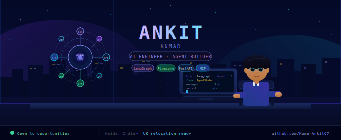

<div align="center">



<br/>


<br/>

[](https://linkedin.com/in/YOUR_HANDLE)
[](https://YOUR_PORTFOLIO.dev)
[](https://github.com/KumarAnkit67)
[](mailto:YOUR_EMAIL)


</div>

---

## ◈ About Me

```python
# ═══════════════════════════════════════════════════════════════
# Engineer. Agent Builder. Problem Destroyer.
# ═══════════════════════════════════════════════════════════════

class Ankit(AIEngineer):

    def __init__(self):
        self.title    = "Full Stack Dev → AI Engineer (in progress)"
        self.location = "Noida, India 🇮🇳  →  Open to UK relocation 🇬🇧"
        self.company  = "Wingman Partners Solution LLP"
        self.years_xp = 2  # and counting ↑

        self.superpowers = [
            "Build AI Agents that reason, retrieve and act",
            "Design RAG pipelines with Pinecone + FAISS",
            "Orchestrate multi-agent workflows via LangGraph",
            "Ship full-stack apps: React Native → FastAPI",
        ]

        self.currently_obsessed_with = {
            "framework": "LangGraph",
            "protocol" : "MCP",
            "concept"  : "Agentic AI Workflows",
            "goal"     : "Production-grade AI at scale",
        }

    def philosophy(self) -> str:
        return (
            "Great software doesn't just respond. "
            "It understands context, retrieves knowledge, "
            "reasons through problems and takes action."
        )

    def run(self):
        build_agent("FreightMind")   # logistics AI orchestration
        ship_feature()               # every single day
        learn("LangGraph, MCP, AI Infra")
        repeat()                     # ∞

# Entry point
if __name__ == "__main__":
    ankit = Ankit()
    ankit.run()  █
```

---

## ◈ What I'm Building Right Now

| Project | Status | Stack |
|---------|--------|-------|
| 🚚 **FreightMind** — AI orchestration for logistics | 🟢 Active | LangGraph · Pinecone · Next.js · PostgreSQL |
| 🤖 **AskBuddy** — AI assistant with memory & search | 🟢 Active | LangGraph · Groq · Tavily · Streamlit |
| 🔬 **AI Research Agent** — Autonomous web researcher | 🔄 Iterating | LangGraph · Gemini · Tavily · Python |
| 🧠 **Multi-Agent Framework** — Custom agent runtime | 🏗 Building | LangGraph · MCP · FastAPI |

---

## ◈ Tech Stack

### 🧠 AI Engineering


### 💻 Languages


### 🖥 Frontend


### ⚙️ Backend & Databases


### 🛠 Tools


---

## ◈ Featured Projects

<table>
<tr>
<td width="50%" valign="top">

### 🚚 FreightMind
> AI orchestration platform for logistics operations

**What it does:**
- RAG over operational SOPs & carrier docs
- Intelligent exception routing with LangGraph
- Automated carrier API lookups (FedEx, DHL)
- AI-powered shipment recommendations
- Customer notification drafting with LLM

**Stack:** `LangGraph` `OpenAI / Gemini` `Pinecone` `Next.js` `PostgreSQL`

[](https://github.com/KumarAnkit67)

</td>
<td width="50%" valign="top">

### 🤖 AskBuddy
> AI-powered assistant with persistent memory & live web search

**What it does:**
- Streaming LLM responses via Groq
- Long-term memory persistence across sessions
- Tool-calling: web search, calculator, code exec
- Multi-turn conversational UI
- Real-time Tavily web search integration

**Stack:** `LangGraph` `Groq` `Tavily` `Streamlit` `Python`

[](https://github.com/KumarAnkit67)

</td>
</tr>
<tr>
<td width="50%" valign="top">

### 🔬 AI Research Agent
> Autonomous research assistant — searches, reads, synthesizes

**What it does:**
- Autonomous multi-step web research
- Source discovery & credibility scoring
- Information summarization & synthesis
- Structured markdown report generation
- Citation tracking across sources

**Stack:** `LangGraph` `Gemini` `Tavily` `Python`

[](https://github.com/KumarAnkit67)

</td>
<td width="50%" valign="top">

### 🧠 Multi-Agent System (WIP)
> Custom runtime for orchestrating specialized AI agents

**What it does:**
- Planner → Router → Executor → Critic loop
- Shared memory & state across agents
- MCP tool integration
- Configurable agent personas & roles
- Real-time execution tracing

**Stack:** `LangGraph` `MCP` `FastAPI` `OpenAI` `Python`

[](https://github.com/KumarAnkit67)

</td>
</tr>
</table>

---

## ◈ Learning Roadmap

```
FOUNDATIONS ━━━━━━━━━━━━━━━━━━━━━━━━━━━━━━━━━━━━━━━━━━━━━━━━━━━━━━━━━━━━━━━━━━ FRONTIER

✅ Python          ✅ React Native     ✅ APIs            ✅ LangChain
✅ RAG Basics      ✅ Vector DBs       ✅ Tool Calling     ✅ AI Agents

🔄 LangGraph       🔄 MCP             🔄 Multi-Agent     🔄 AI Infrastructure
🔄 Advanced RAG    🔄 AI System Design 🔄 Prod AI Systems 🔄 AI SaaS Products

⬜ AI Infra (K8s)  ⬜ Fine-tuning      ⬜ RL + RLHF       ⬜ AI-native products
```

---

## ◈ 2026 Goals

- [ ] 🚀 Ship **5 production-grade AI projects**
- [ ] 🧠 Master **LangGraph** end-to-end
- [ ] 🏗 Learn **AI System Design** at scale
- [ ] 🌍 Contribute to **Open Source** AI tools
- [ ] 💼 Land an **AI Engineering role** (UK preferred)
- [ ] 🛠 Launch an **AI SaaS Product**
- [ ] 📝 Start writing about **building agents in public**

---

## ◈ GitHub Analytics

<div align="center">


</div>

<div align="center">


</div>

<div align="center">


</div>

---

## ◈ Philosophy

<div align="center">

> *"Great software doesn't just respond.*
> *It understands context, retrieves knowledge,*
> *reasons through problems, and takes action."*

</div>

The systems I care about combine five things:

```
  REASONING  ──┐
  RETRIEVAL  ──┤
  MEMORY     ──┼──▶  Intelligent Systems that Solve Real Problems
  AUTOMATION ──┤
  ACTION     ──┘
```

Not AI demos. Not wrappers. **Systems that work.**

---

## ◈ Connect With Me

<div align="center">

| Platform | Link |
|----------|------|
| 💼 LinkedIn | [linkedin.com/in/YOUR_HANDLE](https://linkedin.com/in/YOUR_HANDLE) |
| 🌐 Portfolio | [yourportfolio.dev](https://YOUR_PORTFOLIO.dev) |
| 📧 Email | [your@email.com](mailto:YOUR_EMAIL) |
| 🐦 Twitter / X | [@YOUR_HANDLE](https://twitter.com/YOUR_HANDLE) |

</div>

---

<div align="center">

```
◈ ━━━━━━━━━━━━━━━━━━━━━━━━━━━━━━━━━━━━━━━━━━━━━━━━━━━━━━━━━━━━━━━━━━━━━━━━━━━━ ◈
          Building Today What AI Will Automate Tomorrow
◈ ━━━━━━━━━━━━━━━━━━━━━━━━━━━━━━━━━━━━━━━━━━━━━━━━━━━━━━━━━━━━━━━━━━━━━━━━━━━━ ◈
```

</div>